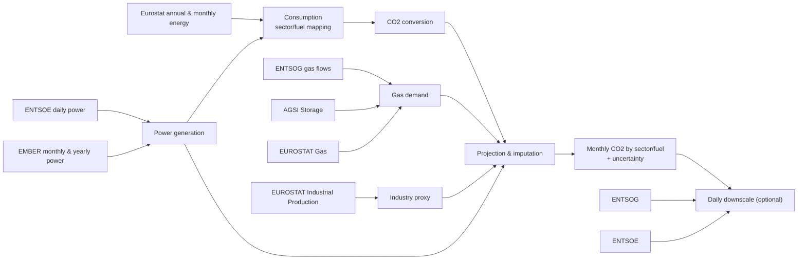

# CREA CO2 Tracker
The EU CO2 Emission Tracker is an initiative by the Centre for Research on Energy and Clean Air (CREA) to produce timely and publicly available data on Europe’s CO2 emissions. By monitoring and analyzing emissions across the power sector, transport, industry, and buildings, the CO2 Tracker aims to help decision-makers, researchers, and the wider society understand the latest trends and respond effectively to climate challenges.

Live charts are available on [CREA's website](https://energyandcleanair.org/product/eu-co2-emission-tracker/).

Latest methodology document is available [here](https://energyandcleanair.org/wp/wp-content/uploads/2026/01/CO2-methodology.pdf)

## How It Works

### CO2
`get_co2()` builds a consistent monthly CO2 time series using Eurostat fossil fuel and external proxy datasets, then optionally downscales to daily and applies post-processing/validation.

1. Gather inputs: Eurostat fossil fuel consumption (annual + monthly), industrial production, ENTSOE+EMBER power generation, and gas demand based on ENTSOG (optionally scaled to Eurostat). Building `eurostat_cons` is the main step where much of the sector/fuel attribution logic happens.
2. Convert energy to CO2 using NCV choices and IPCC emission factors to produce monthly emissions by fuel and sector.
3. Project and impute missing/recent months with proxy models and EU‑level heuristics, then forecast remaining gaps with uncertainty bounds and reconcile sector totals.
4. Optionally downscale monthly values to daily using power and gas proxies.
5. Post‑process outputs (split gas, recombine fuels like peat → coal, add totals, validate, add region names, apply filters).

### Weather-controlled CO2
`get_weather_corrected_co2()` takes the output of `get_co2()` and adjusts emissions for weather‑driven effects in demand and the power mix. It returns a corrected CO2 series plus the correction factors used.

1. Renewables / power‑mix: estimates how weather‑driven hydro/solar/wind output shifts the fossil share, and applies a yearly correction factor that adjusts emissions for that mix change.
2. Demand: estimates weather‑driven demand using HDD/CDD, applies a daily correction factor by fuel/sector, and scales emissions accordingly.

> **Warning**
> Weather‑controlled CO2 and demand components currently use different weather‑correction models. They should be aligned for full consistency.

### Demand components
`get_demand_components()` decomposes daily gas and electricity demand into heating, cooling, and non‑weather components using HDD/CDD regressions. It also provides weather‑corrected demand based on climatological mean HDD/CDD.

## TO DO
[ ] scale monthly power generation data to yearly values (the latter is more accurate and can be significantly different)

[ ] Align weather‑correction models between Weather‑controlled CO2 and Demand components.

[ ] Bring over benchmarks and some of Lauri's analysis from [2025 study](https://github.com/energyandcleanair/202511_2025_eu_emissions)

## Release Notes

### Version 1.1
Version used for January 2026 Report.

#### Changes
- Power generation now taken as a mix of ENTSOE and EMBER
- Peat and oil for electriciy are now considered
- EMBER Other fossil used for as potential predictor and downscaler for peat/oil electricity
- Added a IEA shared NCV option (all countries sharing the same NCV values)
- International transport excluded from comparison with GCB

### Version 0.9
Version used for 31 March 2025 Report.

#### Changes
- National level data is now available for all sectors
- Peat and shale oil restored
- Improved data imputation

### Version 0.6
#### Changes
- Added transportation sector (oil only)

### Version 0.5
#### Changes
- Added confidence interval in the projection of most recent data

### Version 0.4

#### Changes
- Improved handling of partial data in EUROSTAT datasets (e.g., availability of coal data for electricity but not for industrial uses)
- Utilized industrial production data to estimate coal and coke consumption in non-electricity sectors

#### Impact
This update eliminates the previously observed sudden drop in coal emissions at the end of 2023.
