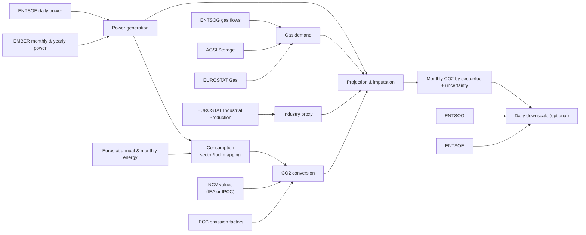

# CREA CO2 Tracker
The EU CO2 Emission Tracker is an initiative by the Centre for Research on Energy and Clean Air (CREA) to produce timely and publicly available data on Europe’s CO2 emissions. By monitoring and analyzing emissions across the power sector, transport, industry, and buildings, the CO2 Tracker aims to help decision-makers, researchers, and the wider society understand the latest trends and respond effectively to climate challenges.

Live charts are available on [CREA's website](https://energyandcleanair.org/product/eu-co2-emission-tracker/).

Latest methodology document is available [here](https://energyandcleanair.org/wp/wp-content/uploads/2026/01/CO2-methodology.pdf)

## Recommended Development Setup

Open this repository in the provided VS Code dev container.

The dev container is the recommended way to work on `creaco2tracker` because it includes the R runtime, system libraries, and editor tooling that this project expects. It also gives GitHub Copilot access to the repository's compatible local skills and keeps package installation isolated to the workspace.

In VS Code:

1. Install the Dev Containers extension if needed.
2. Open the repository.
3. Run `Dev Containers: Reopen in Container`.

The container configuration lives in `.devcontainer/` and sets up the project library under `.r-lib/`.

## How It Works

### CO2
`get_co2()` builds a consistent monthly CO2 time series using Eurostat fossil fuel and external proxy datasets, then optionally downscales to daily and applies post-processing/validation.

1. Gather inputs: Eurostat fossil fuel consumption (annual + monthly), industrial production, ENTSOE+EMBER power generation, and gas demand based on ENTSOG (optionally scaled to Eurostat). Building `eurostat_cons` is the main step where much of the sector/fuel attribution logic happens.
2. Convert energy to CO2 using NCV choices and IPCC emission factors to produce monthly emissions by fuel and sector.
3. Project and impute missing/recent months with proxy models and EU‑level heuristics, then forecast remaining gaps with uncertainty bounds and reconcile sector totals.
4. Optionally downscale monthly values to daily using power and gas proxies.
5. Post‑process outputs (split gas, recombine fuels like peat → coal, add totals, validate, add region names, apply filters).


```mermaid
flowchart LR
  
  B[ENTSOE daily power] --> D[Power generation]
  D --> C
  B2[EMBER monthly & yearly power] --> D
  E[ENTSOG gas flows] --> F[Gas demand]
  E2[AGSI Storage] --> F
  E3[EUROSTAT Gas] --> F
  G[EUROSTAT Industrial Production] --> H[Industry proxy]
  A[Eurostat annual & monthly energy] --> C[Consumption <br> sector/fuel mapping]
  C --> I[CO2 conversion]
  N["NCV values<br/>(IEA or IPCC)"] --> I
  O[IPCC emission factors] --> I
  D --> J[Projection & imputation]
  F --> J
  H --> J
  I --> J
  J --> K[Monthly CO2 by sector/fuel\n+ uncertainty]
  K --> L["Daily downscale (optional)"]
  K2[ENTSOG] --> L
  K3[ENTSOE] --> L
```

### Weather-controlled CO2
`get_weather_corrected_co2()` takes the output of `get_co2()` and adjusts emissions for weather‑driven effects in demand and the power mix. It returns a corrected CO2 series plus the correction factors used.


1. Renewables / power‑mix: estimates how weather‑driven hydro/solar/wind output shifts the fossil share, and applies a yearly correction factor that adjusts emissions for that mix change.
2. Demand: estimates weather‑driven demand using HDD/CDD, applies a daily correction factor by fuel/sector, and scales emissions accordingly.

> **Warning**
> Weather‑controlled CO2 and demand components currently use different weather‑correction models. They should be aligned for full consistency.

### Demand components
`get_demand_components()` decomposes daily gas and electricity demand into heating, cooling, and non‑weather components using HDD/CDD regressions. It also provides weather‑corrected demand based on climatological mean HDD/CDD.

### Data masking for historical availability scenarios
`get_co2()`, `get_demand_components()`, `get_corrected_demand()`, and `update_all()` accept a `data_masking` argument to simulate missing historical data by source.

Masking is now available at two levels:
- Granular pre-blend sources (recommended): masks raw source inputs before reconciliation.
- Compatibility coarse sources: masks post-processed tables as in previous versions.

Use `get_data_masking_config()` as a template and then define global (`all`) and per-source rules.

```r
mask_cfg <- get_data_masking_config()

# Global rule: for EU, hide all source values up to Jan-2020
mask_cfg$all <- list(
  date_to = "2020-01-31",
  iso2 = "EU"
)

# Source-specific rule: hide ENTSOE wind data from 2023 onward
mask_cfg$entsoe_power_daily <- list(
  list(
    date_from = "2023-01-01",
    source = "Wind"
  )
)

# Source-specific rule: hide EMBER monthly hydro for 2021
mask_cfg$ember_power_monthly <- list(
  list(
    date_from = "2021-01-01",
    date_to = "2021-12-31",
    source = "Hydro"
  )
)

# Source-specific rule: hide ENTSOG storage flows in 2022
mask_cfg$entsog_flow_raw <- list(
  list(
    date_from = "2022-01-01",
    date_to = "2022-12-31",
    type = "storage"
  )
)

# Source-specific rule: hide HDD values for EU weather in 2024
mask_cfg$weather <- list(
  list(
    date_from = "2024-01-01",
    date_to = "2024-12-31",
    variable = "hdd",
    region_id = "EU"
  )
)

co2 <- get_co2(data_masking = mask_cfg)
```

Granular pre-blend source keys:
- `entsoe_power_daily`, `ember_power_monthly`, `ember_power_yearly`
- `entsog_flow_raw`, `agsi_storage_daily`, `eurostat_gas_monthly_for_correction`
- `eurostat_oil_monthly`, `eurostat_oil_yearly`
- `eurostat_solid_monthly`, `eurostat_solid_yearly`
- `eurostat_gas_monthly`, `eurostat_gas_yearly`
- `eurostat_indprod`, `weather`

Compatibility coarse keys (still supported):
- `power_generation`, `gas_demand`, `eurostat_cons`

Rule fields:
- `date_from`/`available_from` and `date_to`/`available_to` define time windows.
- Any other field is treated as a column filter for the source table (for example `iso2`, `source`, `fuel`, `sector`, `variable`, `nace_r2_code`, `siec_code`).
- Matching rows are masked by removing them from the source table, simulating unavailable data as absent rows.

For the default publication-lag revision-analysis setup, use `data_masking_as_of()` or the
2025 CO2 revision-analysis workflow:

```r
results <- validate_get_co2_revision_analysis()
```

This runs `get_co2()` at each 2025 month-end for all EU countries plus the EU aggregate,
using the default as-of masks, and compares each vintage month with the reference vintage
month `2026-03-01`. Outputs are written by default to
`diagnostics/get_co2_revision_analysis_2025`.

Key outputs:
- `tables/vintage_revision_comparison.csv`: One row per comparable estimate with lag buckets,
  revision metrics, and source-maturity shares.
- `tables/debug_revision_summary.csv`: Lag-bucket and maturity-stage summaries for totals,
  country totals, and country-components.
- `tables/revision_outliers.csv`: Largest absolute revisions, sorted by tonnes CO2.
- `tables/country_component_chart_inventory.csv`: Every generated country-component chart path.
- `charts/summary/`: Aggregate debugging charts by lag bucket, data maturity, and gross
  revision contribution.
- `charts/aggregate_timeseries/` and `charts/country_component/`: Milestone-vintage time
  series and full country-component debugging charts.


## TO DO
[ ] scale monthly power generation data to yearly values (the latter is more accurate and can be significantly different)

[ ] <span style="color:red">Align weather‑correction models between Weather‑controlled CO2 and Demand components.</span>

[ ] Bring over benchmarks and some of Lauri's analysis from [2025 study](https://github.com/energyandcleanair/202511_2025_eu_emissions)


## Running Scripts

Use `./rr` to run repository scripts in a containerized R runtime.

### Requirements

- Podman
- `GITHUB_PAT` in your enviironment or `.Renviron` to get the private R dependencies in our repo

### Modes

- `./rr run <script-or-rscript-args...>`: runs `Rscript` in the runtime image.
- `./rr shell`: opens an interactive shell in the same runtime context.
- `./rr clean [--all] [--purge-cache]`: removes project-scoped container artifacts.

### Behavior

- Automatically builds the runtime image on first use.
- Automatically rebuilds when build inputs change (`rr.Dockerfile`, `DESCRIPTION`, `rr`).
- Bind-mounts the full repository to preserve existing relative-path behavior.
- Keeps R dependencies in image-managed library paths outside the workspace mount.
- Persists pak cache in a project-scoped Podman volume.

### Examples

```bash
./rr run <path-to-script>
./rr run -e "<custom-code>"
./rr shell
./rr clean --all --purge-cache
```


## Release Notes

### Version 1.1
Version used for January 2026 Report.

#### Changes
- Power generation now taken as a mix of ENTSOE and EMBER
- Peat and oil for electriciy are now considered
- EMBER Other fossil used for as potential predictor and downscaler for peat/oil electricity
- Added a IEA shared NCV option (all countries sharing the same NCV values)
- International transport excluded from comparison with GCB


### Version 0.9
Version used for 31 March 2025 Report.

#### Changes
- National level data is now available for all sectors
- Peat and shale oil restored
- Improved data imputation


### Version 0.6
#### Changes
- Added transportation sector (oil only)

### Version 0.5
#### Changes
- Added confidence interval in the projection of most recent data

### Version 0.4

#### Changes
- Improved handling of partial data in EUROSTAT datasets (e.g., availability of coal data for electricity but not for industrial uses)
- Utilized industrial production data to estimate coal and coke consumption in non-electricity sectors

#### Impact
This update eliminates the previously observed sudden drop in coal emissions at the end of 2023.
