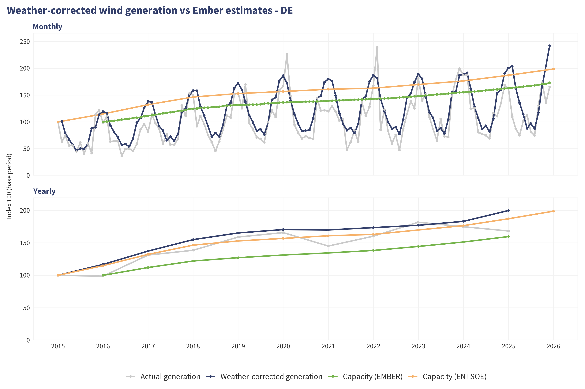
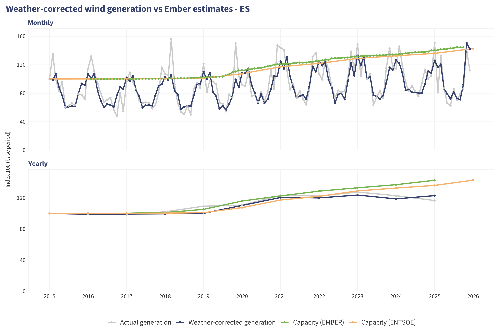
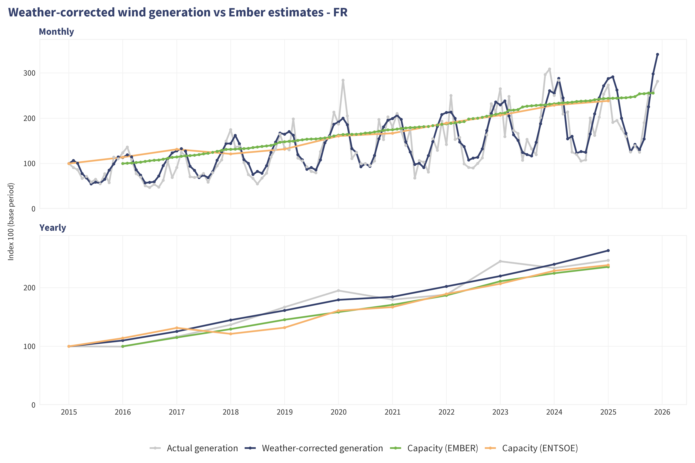
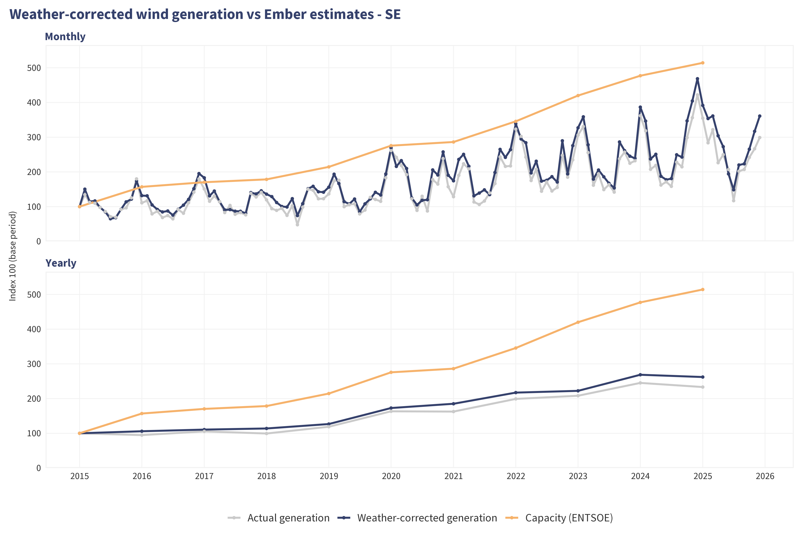
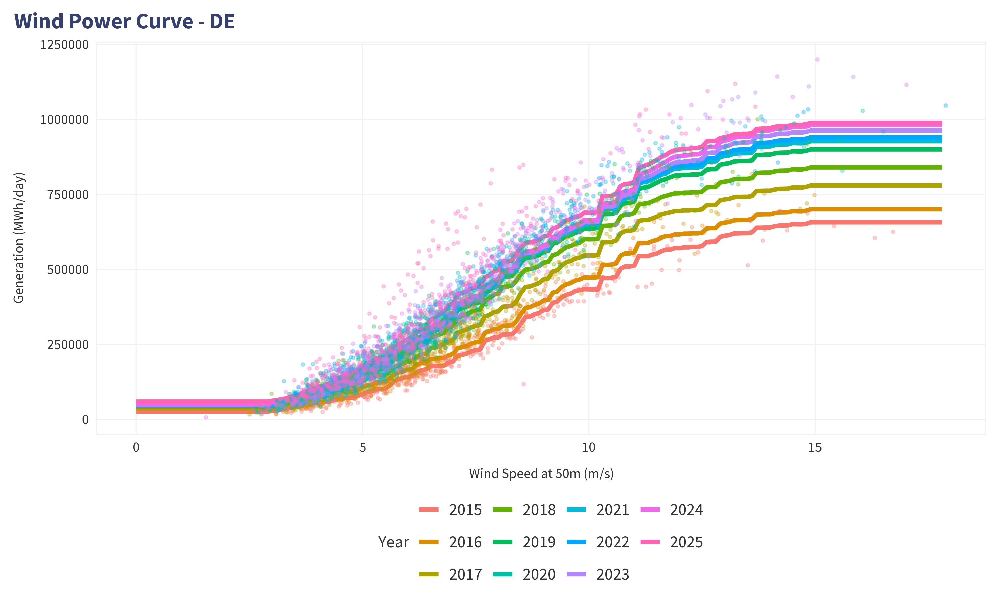
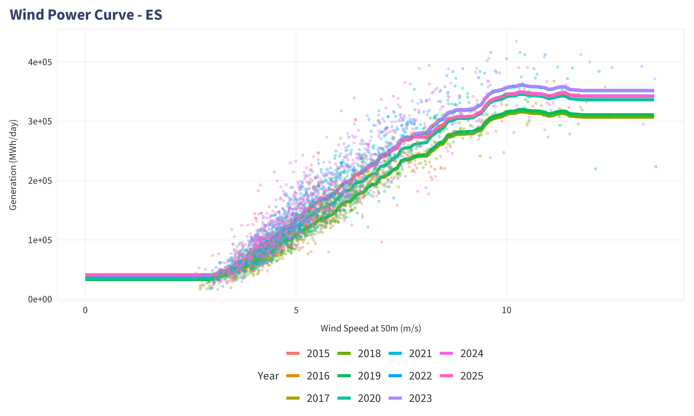
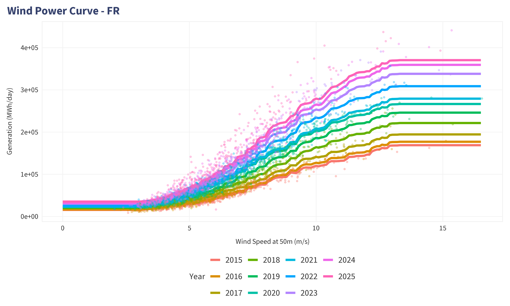
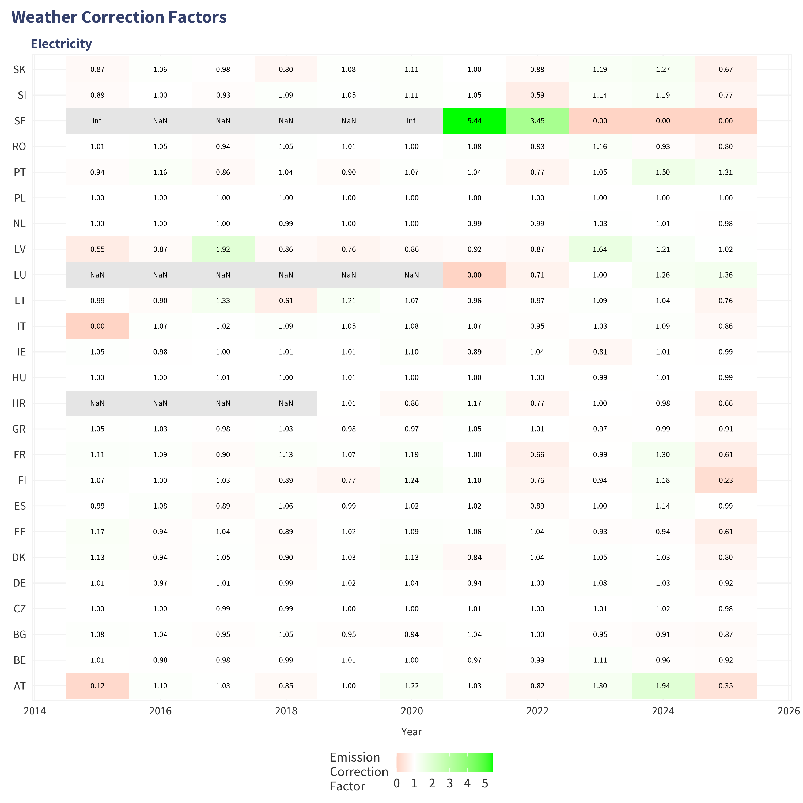

# Weather Correction Methodology

**Version**: 1.1
**Date**: 2026-01-05
**Purpose**: Internal documentation of weather correction approach for CO2 emissions tracking

---

## High-Level Overview

Weather corrections remove the impact of abnormal weather conditions on CO2 emissions through a 3-step process:

```
1. Correct Demand → Temperature-adjusted electricity & gas demand
2. Correct Renewables → Weather-normalized wind/solar and normalised hydro generation
   ↓
3. Calculate Powermix → Renewable displacement of thermal generation
   ↓
4. Apply to CO2 → Weather-corrected emissions
```

**Core Formula**: `corrected = actual + (fitted_normal - fitted_actual)`
This additive approach preserves residuals (unexplained variation) which contain real trends.

---

## 1. Demand Correction

### 1.1 Electricity Demand

**Model**: Linear regression with HDD, CDD, and day-of-week
**Formula**: `demand ~ HDD + CDD + wday(date)`

**Weather Variables**:
- **HDD** (Heating Degree Days): Captures heating demand when cold
- **CDD** (Cooling Degree Days): Captures cooling demand when hot
- **wday**: Controls for weekly patterns (weekday vs weekend)

**Correction Steps**:
```r
# 1. Fit model on actual weather
model <- lm(value_mw ~ hdd + cdd + as.factor(wday), data = actual_data)

# 2. Predict at actual weather
fitted_actual <- predict(model, actual_data)

# 3. Create climatology (average weather by day-of-year)
normal_weather <- actual_data %>%
  group_by(yday(date)) %>%
  mutate(hdd = mean(hdd), cdd = mean(cdd))

# 4. Predict at normal weather
fitted_normal <- predict(model, normal_weather)

# 5. Calculate correction factor (preserves residuals!)
correction_factor = 1 + (fitted_normal - fitted_actual) / value_actual
```

**Output**: Daily correction factors by country
**Granularity**: Country-level, daily
**Applies to**: `sector = "total"`, `fuel = "electricity"`


---

### 1.2 Gas Demand (Non-Power Sector)

**Model**: Linear regression with HDD only (no cooling effect for gas)
**Formula**: `demand ~ HDD`

**Key Difference from Electricity**:
- **No CDD term**: Gas demand not affected by cooling
- **Monthly averaging**: Gas CO2 data is monthly before certain dates, so we average to monthly for training to reduce bias
- **Sector**: Only non-power sectors (`sector != "electricity"`)

**Applies to**: `sector %in% non_power_sectors`, `fuel = "fossil_gas"`


---

## 2. Renewable Generation Correction

### 2.1 Wind Correction

**Model**: Gradient Boosting Machine (gbm)
**Formula**: `value_mwh ~ 0 + year + ws_1 + ws_2 + ws_3*inv_temp`

**Weather Variables**:
- **ws_1, ws_2, ws_3**: Wind speed at 50m and polynomial terms (m/s) from NASA Power.
- **temp**: Temperature at 10m from NASA Power.
- **inv_temp**: Inverse temperature (1/K) - captures air density effects

These variables are collected at the **location of wind turbines as identified by GEM in their wind tracker** (latest version i.e. February 2025).

Weather-corrected wind generation on date `d1` is estimated by:
-taking all weather conditions for the same `yday=yday(d1)`
-predicting wind generation with each of this weather conditions in year `year(d1)`
-averaging wind generation.

We do it this way for two reasons:
- the model is non-linear: predicting at the average wind speed is not similar to averaging the predictions;
- we could consider only the year effect, but this approach allows us to have daily values which could prove useful for mid-year reports, and for the online tracker.

**Correction Steps**:
```r
# 1. Fit GBM model
model <- gbm(value_mwh ~ 0 + year + ws_1 + ws_2 + ws_3*inv_temp,
             data = actual_data, n.trees = 1000, interaction.depth = 3)

# 2. Predict at actual weather
fitted_actual <- predict(model, actual_data)

# 3. For each date, cross with all historical weather for that day-of-year
crossed_weather <- actual_data %>%
  mutate(yday = yday(date)) %>%
  select(yday, ws_1, ws_2, ws_3, inv_temp, temp) %>%
  full_join(
    actual_data %>% distinct(date, year, yday),
    by = "yday", relationship = "many-to-many"
  )

# 4. Predict at normal weather (average of predictions, not average weather!)
crossed_weather$predicted_mwh <- predict(model, crossed_weather)
fitted_normal <- crossed_weather %>%
  group_by(date) %>%
  summarise(fitted_normal = mean(predicted_mwh))

# 5. Weather-corrected generation (preserves residuals!)
corrected = actual + (fitted_normal - fitted_actual)
```

**Validation**

Taking four largest wind producers, and comparing evolution of weather-corrected vs installed capacity:







**Wind Power Curves**:

Wind power curves are decently captured by the model:






**Potential Improvements**:
- Use hourly data rather than daily
- Account for installation year of turbines
- Some regularization / smoothing of the model / power curve

---

### 2.2 Solar Correction

**Model**: Gradient Boosting Machine (gbm)
**Formula**: `value_mwh ~ 0 + year + solar_radiation`

**Weather Variables**:
- **solar_radiation**: From ERA5: Amount of solar radiation (also known as shortwave radiation) reaching the surface of the Earth. This variable comprises both direct and diffuse solar radiation. Radiation from the Sun (solar, or shortwave, radiation) is partly reflected back to space by clouds and particles in the atmosphere (aerosols) and some of it is absorbed. The rest is incident on the Earth's surface (represented by this variable).


**Correction Steps**:
```r
# 1. Fit GBM model
model <- gbm(value_mwh ~ 0 + year + solar_radiation,
             data = actual_data, n.trees = 1000, interaction.depth = 3)

# 2. Predict at actual weather
fitted_actual <- predict(model, actual_data)

# 3. Cross each date with all historical solar radiation for that day-of-year
crossed_weather <- actual_data %>%
  mutate(yday = yday(date)) %>%
  select(yday, solar_radiation) %>%
  full_join(
    actual_data %>% distinct(date, year, yday),
    by = "yday", relationship = "many-to-many"
  )

# 4. Predict then average (not average then predict)
crossed_weather$predicted_mwh <- predict(model, crossed_weather)
fitted_normal <- crossed_weather %>%
  group_by(date) %>%
  summarise(fitted_normal = mean(predicted_mwh))

# 5. Apply correction
corrected = actual + (fitted_normal - fitted_actual)
```

**Granularity**: Country-level, daily

---

### 2.3 Hydro Correction

**Model**: Capacity factor normalization, not really a weather-correction
**Approach**: Average capacity factor over the 11 years since 2015

**Steps**:
```r
# 1. Calculate capacity factor
cf = actual_generation_mwh / (capacity_mw × 24h)

# 2. Calculate average
cf_avg = mean(cf)

# 3. Calculate ratio
ratio = cf_avg / cf

# 4. Apply ratio to generation
corrected = actual_generation × ratio
```

**Why Different from Wind/Solar?**
- Hydro affected by precipitation patterns (months-long), not daily weather and potentially other factors (e.g. irrigation needs, melting glaciers)
- Water reservoir dynamics ≠ wind/solar instantaneous response
- CF normalization may not be "weather correction" per se

---

## 3. Electricity mix correction

**Purpose**: Convert weather-corrected renewable generation into CO2 emission correction factors

**Assumptions**:
- 1 MWh renewable displaces 1 MWh thermal generation.
- This is done in each country individually.

**However**, some countries have low thermal generation and such correction could lead in some years to unreasonable levels of thermal generation (e.g. for countries with essentially Nuclear + RES mix, it could 100x thermal generation), **we cap corrected thermal generation at the maximum level observed since 2015**. The rest is assumed to be compensated by nuclear / zero-carbon sources.

**Results**:



---

## 4. Combined CO2 Correction

**Core Formula**:


| Fuel | Sector | Correction |
|------|--------|------------|
|   Gas   |  All but power       |  Demand correction - Gas           |
| All | Power | Electricity mix correction x Demand correction - Electricity |


**Key Assumption**: At this stage, we consider first order only and ignore interaction i.e. the fact that reduced demand would have led to a different electricity mix.

**Potential improvements**: account for potential interaction between demand change and electricity mix.
---

